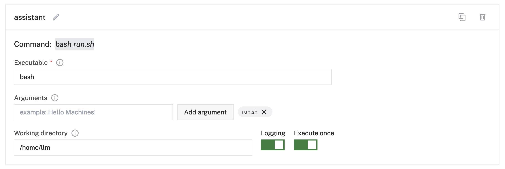

# Viam Smart Assistant

A program that assembles the Chat and Speech service capabilities for Viam machines into a smarter assistant that can deploy to any supported device.

## Deployment

This guide assumes you already have [a device running `viam-server` that is connected to the Viam app](https://docs.viam.com/get-started/installation/). You should also be familiar with [how to configure a machine](https://docs.viam.com/build/configure/#the-config-tab).

With this project, [cloned to your local computer](https://docs.github.com/en/repositories/creating-and-managing-repositories/cloning-a-repository), enter this project directory in the command line terminal of your choice:

```console
cd viam-smart-assistant
```

To configure the package, make a copy of the `.env.example` file called `.env`:

```
cp .env.example .env
```
Fill out the necessary environment variables in your text editor with the [machine address, API key, and API key ID](https://docs.viam.com/build/program/apis/robot/#establish-a-connection). Fill in the name of the `chat` service and `speech` service configured for the machine.

Prepre the module tarball (bundle of files) to be copied over to your machine:

```
make
```

If that command was successful, there will be a `module.tar.gz` in the project directory. Use [`scp`](https://www.freecodecamp.org/news/scp-linux-command-example-how-to-ssh-file-transfer-from-remote-to-local/) to copy the `module.tar.gz` over the machine:

```console
scp ./module.tar.gz <username>@<machine IP or hostname>:./
```

To unbundle the tarball, you can either `ssh` into the machine and run the `tar` command:

```console
ssh <username@machine IP or hostname>
tar -xzf module.tar.gz
```

Or perform this action as a "remote command" over SSH:

```console
ssh <username@machine IP or hostname> "tar -xzf module.tar.gz"
```

With those files in place, [configure a process](https://docs.viam.com/build/configure/#processes) that executes the `run.sh` script in the home directory of the user on the machine.

Find the home directory path on the machine:

```console
ssh <username@machine IP or hostname> "pwd"
```

The process executable is `bash`, the argument is `run.sh`, and the working directory is the result of the above `pwd` command. It is set to execute once:



**Remember to save the config changes before continuing.**

`viam-server` will pick up those changes and start running the program!

## Development

This project is bootstrapped by [PyprojectX](https://pyprojectx.github.io/) and managed with [PDM](https://pdm-project.org/latest/).

Setup the development environment:

```console
make install
```

Build the package:

```console
make build
```

Run the main script (be sure to copy the `.env.example` as `.env` and fill it out with the necessary values, see [deployment](#deployment) for more info):

```console
make start
```

